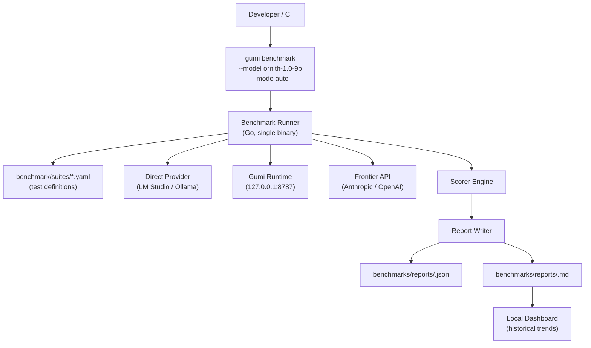
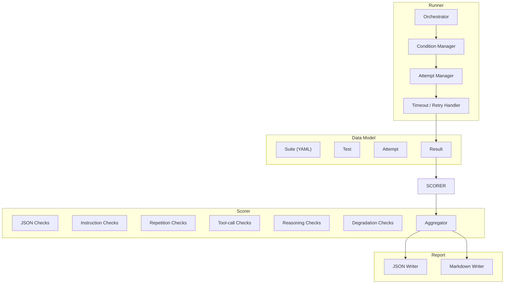
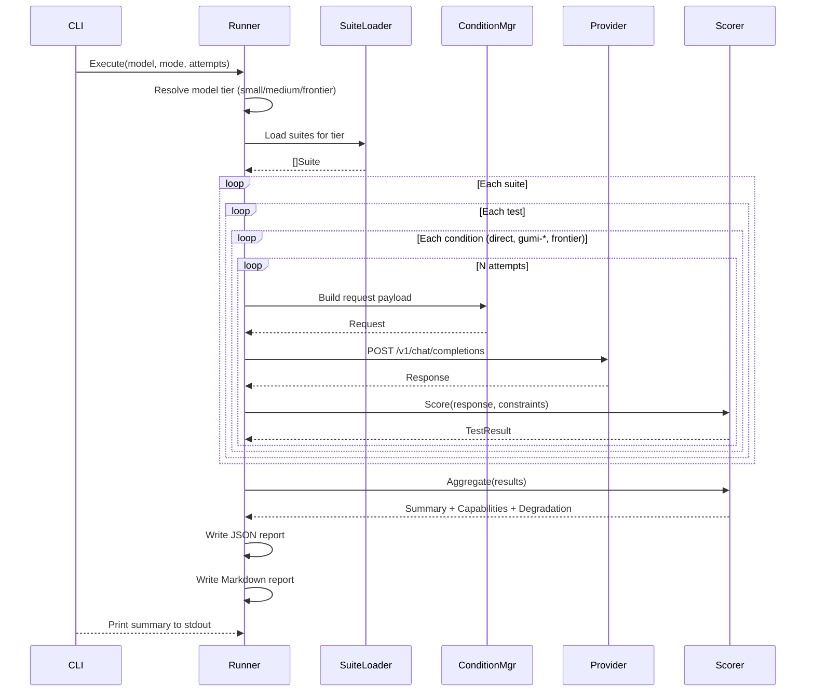

# Gumi Benchmark Specification

**Version:** 1.0  
**Status:** Active  
**Scope:** Benchmark subsystem for Gumi Runtime V1

---

# 1. Purpose

This document defines the Gumi Benchmark subsystem — a unified, scientifically rigorous framework for measuring Gumi's impact on model output quality across local and frontier models.

The benchmark exists to answer one question with statistical confidence: **Does Gumi make this model better, and by how much?**

---

# 2. Design Principles

| Principle | Rationale |
|-----------|-----------|
| **Calibrated difficulty** | Every test tier targets a specific pass-rate range so Gumi's delta has room to express itself. No all-0 or all-100 tests. |
| **Statistical rigor** | Multiple attempts per condition, mean ± std, Cohen's d effect sizes, confidence intervals. |
| **Per-capability scoring** | Isolated scores for JSON, instruction-following, repetition, tool-calling, reasoning — not a single opaque number. |
| **Model-adaptive** | Tier selection, weighting, and emphasis shift automatically based on model class (small / medium / frontier). |
| **Degradation-first** | For frontier models, the primary question is safety (does Gumi break correct output?), not capability boost. |
| **Extensible** | Adding a new test category or difficulty tier requires only a YAML file — no Go recompilation. |
| **Single command** | `gumi benchmark` runs everything, produces one report. |

---

# 3. Architecture Overview

## 3.1 System Context



## 3.2 Internal Architecture



---

# 4. Data Model

## 4.1 Suite Definition (YAML)

```yaml
# suites/instruction/frontier.yaml
suite:
  id: instruction-frontier
  category: instruction
  tier: frontier
  description: "Instruction-following with 8+ simultaneous constraints"
  target_direct_score: 0.30-0.70
  model_profiles: [frontier]
  attempts_recommended: 5

tests:
  - id: inst-frontier-01
    difficulty: frontier
    description: "12 sentences, JSON, no 'the', capital starts, end with 'complete'"
    prompt: |
      Write exactly 12 sentences. Return as valid JSON with key \"response\" and an array value.
      Do not use the word \"the\". Each sentence must start with the next letter of
      \"FABLEFRONTIER\". End with the word \"complete\". No commas. Each sentence must
      contain exactly one number. No markdown fences. At least 600 characters.
    expected: {}
    timeout_seconds: 120
    max_tokens: 2048
    constraints:
      - field: sentence_count
        operator: eq
        value: 12
      - field: json
        operator: valid
      - field: keys_present
        operator: superset
        value: ["response"]
      - field: forbidden_words
        operator: not_contains
        value: ["the"]
      - field: capital_start
        operator: eq
        value: true
      - field: ends_with
        operator: ends_with
        value: "complete"
      - field: no_commas
        operator: eq
        value: true
      - field: min_chars
        operator: gte
        value: 600
      - field: no_markdown
        operator: eq
        value: true
      - field: number_per_sentence
        operator: gte
        value: 1

  - id: inst-frontier-02
    description: "Self-consistency — 5 phrasings, same answer"
    type: self_consistency
    variants:
      - "What is the heaviest naturally occurring element? Be concise."
      - "Name the element with the highest atomic weight found in nature."
      - "Which naturally occurring element has the greatest atomic mass?"
      - "What element has the largest atomic number that occurs naturally?"
      - "Identify the element with the maximum atomic mass in nature."
    expected_answer: "uranium"
    variance_metric: levenshtein
    timeout_seconds: 30
    max_tokens: 50
```

## 4.2 Internal Go Types

```go
// SuiteGroups organizes suites by category and tier.
type SuiteGroups struct {
    Categories []Category `yaml:"categories"`
}

type Category struct {
    ID      string  `yaml:"id"`
    Name    string  `yaml:"name"`
    Weight  float64 `yaml:"weight"` // Per-model-class weight
    Suites  []Suite `yaml:"suites"`
}

type Suite struct {
    ID                   string   `yaml:"id"`
    Category             string   `yaml:"category"`
    Tier                 string   `yaml:"tier"` // easy, medium, hard, frontier
    Description          string   `yaml:"description"`
    TargetDirectScore    string   `yaml:"target_direct_score"` // e.g., "0.30-0.70"
    ModelProfiles        []string `yaml:"model_profiles"`
    AttemptsRecommended  int      `yaml:"attempts_recommended"`
    Tests                []Test   `yaml:"tests"`
}

type Test struct {
    ID              string          `yaml:"id"`
    Difficulty      string          `yaml:"difficulty"`
    Description     string          `yaml:"description"`
    Prompt          string          `yaml:"prompt,omitempty"`
    Type            string          `yaml:"type,omitempty"`  // standard, self_consistency
    Variants        []string        `yaml:"variants,omitempty"`
    ExpectedAnswer  string          `yaml:"expected_answer,omitempty"`
    VarianceMetric  string          `yaml:"variance_metric,omitempty"`
    Expected        interface{}     `yaml:"expected,omitempty"`
    TimeoutSeconds  int             `yaml:"timeout_seconds"`
    MaxTokens       int             `yaml:"max_tokens"`
    Constraints     []Constraint    `yaml:"constraints,omitempty"`
}

type Constraint struct {
    Field    string      `yaml:"field"`    // e.g., "sentence_count"
    Operator string      `yaml:"operator"` // eq, gte, lte, valid, superset, not_contains, starts_with, ends_with
    Value    interface{} `yaml:"value"`
}
```

## 4.3 Result Model

```go
type RunResult struct {
    SchemaVersion    int                  `json:"schema_version"`
    RunID            string               `json:"run_id"`
    Model            string               `json:"model"`
    Provider         string               `json:"provider"`
    ModelTier        string               `json:"model_tier"` // small, medium, frontier
    Config           RunConfig            `json:"config"`
    Summary          Summary              `json:"summary"`
    Capabilities     map[string]Capability `json:"capabilities"`
    Degradation      DegradationReport    `json:"degradation"`
    PerTest          []TestResult         `json:"per_test"`
    FrontierBaseline *FrontierScores      `json:"frontier_baseline,omitempty"`
}

type RunConfig struct {
    Attempts     int      `json:"attempts"`
    Conditions   []string `json:"conditions"`  // direct, gumi-lightweight, gumi-stabilized, gumi-structured
    Tiers        []string `json:"tiers"`
    Timestamp    string   `json:"timestamp"`
}

type Summary struct {
    OverallScore         float64 `json:"overall_score"`
    LatencyOverheadMs    float64 `json:"latency_overhead_ms"`
    DegradationRate      float64 `json:"degradation_rate"`
    FrontierGapReduction float64 `json:"frontier_gap_reduction,omitempty"`
    WorthIt              bool    `json:"worth_it"`
}

type Capability struct {
    Direct          MetricSet `json:"direct"`
    Gumi          MetricSet `json:"gumi"`
    Delta           float64   `json:"delta"`
    EffectSize      float64   `json:"effect_size"`
    FrontierCeiling float64   `json:"frontier_ceiling,omitempty"`
}

type MetricSet struct {
    Mean float64 `json:"mean"`
    Std  float64 `json:"std"`
    N    int     `json:"n"`
}

type TestResult struct {
    TestID    string             `json:"test_id"`
    Condition string             `json:"condition"`
    Attempt   int                `json:"attempt"`
    Passed    bool               `json:"passed"`
    Subscores map[string]float64 `json:"subscores"`
    LatencyMs float64            `json:"latency_ms"`
    Output    string             `json:"-"` // Not serialized, written to artifact file
    Error     string             `json:"error,omitempty"`
}

type DegradationReport struct {
    OverRepairCount int                 `json:"over_repair_count"`
    TotalTests      int                 `json:"total_tests"`
    DegradationRate float64             `json:"degradation_rate"`
    Corruptions     []CorruptionRecord  `json:"corruptions,omitempty"`
    LatencyOverhead map[string]float64  `json:"latency_overhead_by_mode"`
}

type CorruptionRecord struct {
    TestID   string `json:"test_id"`
    Original string `json:"original"`  // truncated
    Repaired string `json:"repaired"`  // truncated
    Severity string `json:"severity"`  // cosmetic, semantic
}

type FrontierScores struct {
    Model string              `json:"model"`
    Scores map[string]float64 `json:"scores"`
}
```

---

# 5. Runner Specification

## 5.1 Flow



## 5.2 Condition Modes

| Condition ID | Target | Request Modifications |
|-------------|--------|----------------------|
| `direct` | Raw provider | No modifications. Model name passed as-is. |
| `gumi-direct` | Gumi → provider | Prefix model with `lmstudio:` or `ollama:`. No `gumi` param. |
| `gumi-lightweight` | Gumi → provider | Add `gumi: {mode: lightweight}` |
| `gumi-stabilized` | Gumi → provider | Add `gumi: {mode: stabilized}` |
| `gumi-structured` | Gumi → provider | Add `gumi: {mode: structured}` |
| `frontier` | Frontier API | Route to configured frontier provider. Only for frontier tier when `--frontier-key` is set. |

## 5.3 Tier Auto-Selection

```go
func ResolveTier(model string, provider string) (string, error) {
    // 1. Check explicit model profiles first
    profile, ok := profiles.Get(model)
    if ok {
        switch {
        case profile.SizeInB < 8:
            return "small", nil
        case profile.SizeInB <= 32:
            return "medium", nil
        default:
            return "frontier", nil
        }
    }

    // 2. Fall back to provider-based heuristic
    switch provider {
    case "anthropic", "openai", "google":
        return "frontier", nil
    case "lmstudio", "ollama":
        return heuristicByModelName(model), nil
    default:
        return "medium", nil // conservative default
    }
}
```

## 5.4 Executed Suites by Tier

| Tier | Easy | Medium | Hard | Frontier | Degradation |
|------|------|--------|------|----------|-------------|
| **small** | ✅ | ✅ | optional | — | ✅ (cosmetic only) |
| **medium** | ✅ | ✅ | ✅ | — | ✅ (cosmetic + semantic) |
| **frontier** | — | optional | ✅ | ✅ | ✅ (full suite) |

## 5.5 Attempt Management

- **Default**: 3 attempts per (test, condition) pair.
- **Quick mode** (`--attempts 1`): Single attempt. No standard deviation reported. Effect size estimated from pooled historical variance.
- **Thorough mode** (`--attempts 10`): Full statistical rigor. Reports 95% confidence intervals.
- **Frontier mode** (`--attempts 5`): Default for frontier models. Balances cost (API calls) with statistical validity.

Failed attempts (timeout, empty response, HTTP error) are **excluded** from the per-condition averages but **counted** in a separate reliability metric in the report.

---

# 6. Scorer Specification

## 6.1 Check Registry

Every constraint operator maps to a pure function `(response, constraint) → (passed bool, details string)`.

| Operator | Signature | Used for |
|----------|-----------|----------|
| `eq` | `value == expected` | `sentence_count`, `word_count` |
| `gte` | `value >= expected` | `min_chars`, `min_words`, `line_count` |
| `lte` | `value <= expected` | `max_chars` |
| `valid` | `json.Unmarshal succeeds` | `json` |
| `superset` | `all expected keys present` | `keys_present` |
| `not_contains` | `forbidden word absent` | `forbidden_words` |
| `starts_with` | `starts with character` | `capital_start` |
| `ends_with` | `ends with string` | `end_with` |
| `no_markdown` | `no ``` fences` | `no_markdown` |
| `no_commas` | `no comma character` | `no_commas` |
| `self_consistency` | `variance across variants < threshold` | `self_consistency` |

## 6.2 Per-Capability Aggregation

```go
func Aggregate(results []TestResult, weights map[string]float64) Capability {
    if len(results) == 0 {
        return Capability{}
    }

    var sum float64
    for _, r := range results {
        for check, score := range r.Subscores {
            sum += score * weights[check]
        }
    }

    mean := sum / float64(len(results))
    variance := 0.0
    for _, r := range results {
        var s float64
        for check, score := range r.Subscores {
            s += score * weights[check]
        }
        variance += (s - mean) * (s - mean)
    }
    std := math.Sqrt(variance / float64(len(results)))

    return Capability{
        Mean: round(mean, 4),
        Std:  round(std, 4),
        N:    len(results),
    }
}
```

## 6.3 Effect Size (Cohen's d)

```go
func CohenD(direct, gumi MetricSet) float64 {
    pooledStd := math.Sqrt(
        (float64(direct.N-1)*direct.Std*direct.Std +
         float64(gumi.N-1)*gumi.Std*gumi.Std) /
        float64(direct.N+gumi.N-2),
    )
    if pooledStd == 0 {
        return 0
    }
    return (gumi.Mean - direct.Mean) / pooledStd
}
```

Star rating:

| d range | Rating |
|---------|--------|
| d < 0.2 | — (no effect) |
| 0.2 ≤ d < 0.5 | ★ (small) |
| 0.5 ≤ d < 0.8 | ★★ (medium) |
| d ≥ 0.8 | ★★★ (large) |

## 6.4 Overall Score (Adaptive Weighting)

```go
type ModelWeights struct {
    JSON        float64
    Instruction float64
    Repetition  float64
    ToolCalling float64
    Reasoning   float64
    Degradation float64
    LatencyCost float64 // subtracted, not weighted
}

var weightsByTier = map[string]ModelWeights{
    "small": {
        JSON:        0.35,
        Instruction: 0.25,
        ToolCalling: 0.15,
        Reasoning:   0.10,
        Repetition:  0.10,
        Degradation: 0.05,
        LatencyCost: 0.05,
    },
    "medium": {
        JSON:        0.25,
        Instruction: 0.25,
        ToolCalling: 0.20,
        Reasoning:   0.15,
        Repetition:  0.10,
        Degradation: 0.10,
        LatencyCost: 0.10,
    },
    "frontier": {
        JSON:        0.05,
        Instruction: 0.05,
        ToolCalling: 0.10,
        Reasoning:   0.05,
        Repetition:  0.05,
        Degradation: 0.50,
        LatencyCost: 0.20,
    },
}

func OverallScore(caps map[string]Capability, degrad DegradationReport,
    latencyOverhead float64, tier string) (float64, bool) {

    w := weightsByTier[tier]
    weightedSum :=
        caps["json"].Delta*w.JSON +
        caps["instruction"].Delta*w.Instruction +
        caps["repetition"].Delta*w.Repetition +
        caps["tool_calling"].Delta*w.ToolCalling +
        caps["reasoning"].Delta*w.Reasoning +
        (1-degrad.DegradationRate)*w.Degradation

    latencyPenalty := math.Min(latencyOverhead/1000.0, w.LatencyCost)
    score := weightedSum - latencyPenalty
    worthIt := score > 0.05 // 5% improvement net of penalties

    return round(score, 4), worthIt
}
```

## 6.5 Degradation Detection

```go
// DegradationDetector compares output before and after Gumi processing.
// It runs the same prompt twice:
//   1. Direct to provider (control)
//   2. Through Gumi (treatment)
//
// If outputs differ, it classifies the change as cosmetic or semantic.
type DegradationDetector struct {
    SemanticPatterns []*regexp.Regexp
}

func (d *DegradationDetector) Compare(original, repaired string, test Test) CorruptionRecord {
    if original == repaired {
        return CorruptionRecord{} // no change
    }

    // Normalize for cosmetic comparison
    origNorm := normalizeWhitespace(original)
    repNorm := normalizeWhitespace(repaired)

    if origNorm == repNorm {
        return CorruptionRecord{
            Severity: "cosmetic",
            Detail:   "whitespace-only change",
        }
    }

    // Check for semantic changes: numbers, key names, logical content
    semanticDiffs := d.detectSemanticChanges(original, repaired)
    if len(semanticDiffs) > 0 {
        return CorruptionRecord{
            Severity: "semantic",
            Detail:   strings.Join(semanticDiffs, "; "),
        }
    }

    return CorruptionRecord{
        Severity: "cosmetic",
        Detail:   "formatting change without semantic impact",
    }
}

func normalizeWhitespace(s string) string {
    space := regexp.MustCompile(`\s+`)
    return space.ReplaceAllString(strings.TrimSpace(s), " ")
}
```

---

# 7. Report Specification

## 7.1 Markdown Report

```markdown
# Gumi Benchmark Report

**Model:** {model} · **Provider:** {provider} · **Tier:** {tier}
**Run:** {run_id} · **Attempts per condition:** {n}

## Overall

| Metric | Direct | Gumi Stabilized | Delta | Frontier Ceiling |
|--------|--------|-------------------|-------|------------------|
| **Overall Score** | {val} | {val} | **{delta}** | {val} |
| Latency (p50) | {val}ms | {val}ms | {delta}ms | — |
| Degradation Rate | — | {val}% | — | — |
| **Worth it?** | | **{yes/no}** | | |

## By Capability

| Capability | Direct | Gumi | Δ | Effect Size | Frontier |
|-----------|--------|--------|---|-------------|----------|
| JSON | {m}±{s} | {m}±{s} | **{d}** {stars} | {d_val}σ | {f} |
| Instruction | ... | ... | ... | ... | ... |
| Tool-calling | ... | ... | ... | ... | ... |
| Reasoning | ... | ... | ... | ... | ... |
| Repetition | ... | ... | ... | ... | ... |

*★ = small (d≥0.2) · ★★ = medium (d≥0.5) · ★★★ = large (d≥0.8)*

## By Difficulty

```
Easy (target 70-90%):    ████████████░░░░  Direct {m} → Gumi {m} ({d})
Medium (target 40-70%):  ████████░░░░░░░░  Direct {m} → Gumi {m} ({d}) ★★★
Hard (target 10-40%):    ████░░░░░░░░░░░░  Direct {m} → Gumi {m} ({d}) ★★
Frontier (target 30-70%): ██████░░░░░░░░░░  Direct {m} → Gumi {m} ({d}) ★★
```

## Degradation Check

| Severity | Count | Rate |
|----------|-------|------|
| Cosmetic | {n} | {pct}% |
| Semantic | {n} | {pct}% |
| **Total** | {n} | {pct}% |

{Corruption examples if any}

## Frontier Gap Closure

```
Direct gap to {frontier_model}:  {val}
Gumi gap to {frontier_model}:  {val}
Gap reduction:                  {pct}%
```

## Per-Test Detail

| Test | Tier | Condition | Pass | Subscores | Latency |
|------|------|-----------|------|-----------|---------|
| ... | ... | ... | ✅/❌ | json:1.0, inst:0.8 | 234ms |
```

## 7.2 Artifact Storage

Raw outputs are stored **outside the repo** at `~/.gumi/benchmarks/<run-id>/artifacts/` to avoid bloat. The JSON report contains only aggregate scores and error excerpts, not full outputs.

---

# 8. CLI Interface

## 8.1 Usage

```text
gumi benchmark [flags]

Flags:
  --model string         Model name (e.g., "ornith-1.0-9b@q4_k_m")
  --provider string      Provider (auto-detect, or "lmstudio"/"ollama"/"anthropic"/"openai")
  --mode string          Execution mode: auto | quick | thorough | frontier (default "auto")
  --attempts int         Attempts per condition (default 3)
  --conditions strings   Conditions to test (default "direct,gumi-stabilized")
  --frontier-key string  API key for frontier baseline run (optional)
  --frontier-model string   Frontier model name (default "")
  --output string        Output directory (default "benchmarks/reports/")
  --json                 Machine-readable JSON output to stdout
  --quick                Alias for --mode quick --attempts 1
```

## 8.2 Exit Codes

| Code | Meaning |
|------|---------|
| 0 | Benchmark completed. Gumi "worth it" may be true or false. |
| 1 | Benchmark failed (provider unreachable, no suites found, etc.) |
| 2 | Benchmark completed but Gumi caused degradation above threshold (semantic degradation rate > 5%) |

---

# 9. Suite Catalog

## 9.1 JSON Generation

| ID | Tier | Prompt summary | Checks |
|----|------|---------------|--------|
| json-easy-01 | easy | `Return {"name":"test","value":42}` | valid_json, keys, exact |
| json-easy-02 | easy | Transform 2 flat records to nested | valid_json, keys, arithmetic |
| json-medium-01 | medium | Transform 5 records with summary | valid_json, keys, arithmetic, no_fence |
| json-medium-02 | medium | Generate config from description | valid_json, keys, values_match |
| json-hard-01 | hard | Parse messy CSV to structured JSON | valid_json, keys, row_count, types |
| json-hard-02 | hard | Generate OpenAPI subset from spec | valid_json, schema_compliant, no_fence |
| json-frontier-01 | frontier | Generate OpenAPI 3.1 full schema from prose | valid_json, schema_compliant, key_count≥20, no_fence |
| json-frontier-02 | frontier | Multi-schema conditional JSON (if/then/else) | valid_json, conditional_correct, no_fence |

## 9.2 Instruction Following

| ID | Tier | Constraints count | Checks |
|----|------|-------------------|--------|
| inst-easy-01 | easy | 2 (sentences, no_word) | sentence_count, forbidden_word |
| inst-easy-02 | easy | 3 (lines, capital, end_with) | line_count, capital_start, end_with |
| inst-medium-01 | medium | 4 (min_chars, no_commas, no_markdown, bullets) | min_chars, no_commas, no_markdown, dash_bullets |
| inst-medium-02 | medium | 5 (words, json, keys, no_fence, end_with) | word_count, json, keys, no_markdown, end_with |
| inst-hard-01 | hard | 6 | all pass |
| inst-hard-02 | hard | 7 | all pass |
| inst-frontier-01 | frontier | 8+ | all pass |
| inst-frontier-02 | frontier | self-consistency (5 variants) | variance < threshold |

## 9.3 Repetition Resistance

| ID | Tier | Prompt | Checks |
|----|------|--------|--------|
| rep-easy-01 | easy | "List 3 colors" | unique_lines ≥ 3 |
| rep-medium-01 | medium | "Describe 5 uses of AI in healthcare, each in 2 sentences" | unique_sentences / total ≥ 0.8 |
| rep-hard-01 | hard | "Write a 200-word product description. Then write it again differently." | levenshtein_distance ≥ 0.3 |
| rep-frontier-01 | frontier | "Generate 10 unique JSON records for this schema with distinct values" | unique_count = 10 |

## 9.4 Tool Calling

| ID | Tier | Scenario | Checks |
|----|------|----------|--------|
| tool-easy-01 | easy | "Call read_file on config.json" | tool_valid, name_correct, args_valid |
| tool-medium-01 | medium | "Read file, then based on content, call write_file" | tool_chain, dependency_ok |
| tool-hard-01 | hard | "3-step tool chain with conditional branching" | tool_chain, all_deps_satisfied, no_loop |
| tool-frontier-01 | frontier | "6-step tool chain with state tracking across calls" | tool_chain, state_consistent, no_hallucinated_tools |

## 9.5 Reasoning

| ID | Tier | Prompt | Checks |
|----|------|--------|--------|
| reason-easy-01 | easy | "What is 2+2?" | exact_match("4") |
| reason-medium-01 | medium | Multi-step math word problem | numeric_answer_correct |
| reason-hard-01 | hard | Logic puzzle with 5 constraints | answer_correct, reasoning_consistent |
| reason-frontier-01 | frontier | "Prove or disprove: P ≠ NP in 3 paragraphs" | (qualitative, scored by rubric) |

## 9.6 Degradation

| ID | Tier | What it tests |
|----|------|---------------|
| degrade-cosmetic-01 | all | Perfect JSON `{"a":1}` — Gumi must not add whitespace |
| degrade-cosmetic-02 | all | Correct markdown — Gumi must not strip formatting |
| degrade-semantic-01 | all | Correct answer "Paris" — Gumi must not change to "France" |
| degrade-semantic-02 | all | Code with correct indentation — Gumi must not reformat |
| degrade-frontier-01 | frontier | Fable 5 output known perfect — test all Gumi engines |
| degrade-frontier-02 | frontier | Claude 4 output with correct JSON — test JSON repair doesn't fire |

---

# 10. File Layout

```
gumi/
├── benchmark/                         # NEW: benchmark subsystem
│   ├── cmd/
│   │   └── run.go                     # Orchestrator entry point
│   ├── runner/
│   │   ├── runner.go                  # Test loop, condition dispatch
│   │   ├── conditions.go              # Request building per condition
│   │   ├── provider.go                # HTTP client for providers
│   │   ├── tier.go                    # Tier auto-resolution
│   │   └── runner_test.go
│   ├── suites/
│   │   ├── json/
│   │   │   ├── easy.yaml
│   │   │   ├── medium.yaml
│   │   │   ├── hard.yaml
│   │   │   └── frontier.yaml
│   │   ├── instruction/
│   │   │   ├── easy.yaml
│   │   │   ├── medium.yaml
│   │   │   ├── hard.yaml
│   │   │   └── frontier.yaml
│   │   ├── repetition/
│   │   │   ├── easy.yaml
│   │   │   ├── medium.yaml
│   │   │   ├── hard.yaml
│   │   │   └── frontier.yaml
│   │   ├── tool_calling/
│   │   │   ├── easy.yaml
│   │   │   ├── medium.yaml
│   │   │   ├── hard.yaml
│   │   │   └── frontier.yaml
│   │   ├── reasoning/
│   │   │   ├── easy.yaml
│   │   │   ├── medium.yaml
│   │   │   ├── hard.yaml
│   │   │   └── frontier.yaml
│   │   └── degradation/
│   │       ├── cosmetic.yaml
│   │       ├── semantic.yaml
│   │       └── frontier.yaml
│   ├── scorer/
│   │   ├── scorer.go                  # Scoring engine
│   │   ├── checks.go                  # Check registry
│   │   ├── aggregate.go               # Per-capability aggregation
│   │   ├── effect.go                  # Cohen's d
│   │   ├── degradation.go             # Degradation detection
│   │   └── overall.go                 # Adaptive overall score
│   └── report/
│       ├── json.go                    # JSON report writer
│       ├── markdown.go                # Markdown report writer
│       └── artifacts.go               # Raw output storage
├── runtime/internal/cli/
│   └── commands.go                    # Updated: `gumi benchmark` calls benchmark/runner
└── benchmarks/
    ├── README.md                      # Updated docs
    └── reports/                       # Generated reports (git-committed)
```

---

# 11. Implementation Roadmap

## Phase 0: Foundation (Week 1)

| Task | Effort | Artifact |
|------|--------|----------|
| Define all Go types (Result, Suite, Test, etc.) | 1d | `benchmark/types.go` |
| YAML suite loader | 1d | `benchmark/suite/loader.go` |
| Prompt library: all easy + medium prompts | 2d | `benchmark/suites/*/easy.yaml`, `*/medium.yaml` |

## Phase 1: Runner (Week 2)

| Task | Effort | Artifact |
|------|--------|----------|
| Orchestrator: loop over suites → conditions → attempts | 1d | `benchmark/runner/orchestrator.go` |
| Condition manager: build requests per mode | 1d | `benchmark/runner/conditions.go` |
| Provider client: direct, Gumi, frontier | 1d | `benchmark/runner/provider.go` |
| Tier auto-resolution | 0.5d | `benchmark/runner/tier.go` |

## Phase 2: Scorer (Week 2-3)

| Task | Effort | Artifact |
|------|--------|----------|
| Check registry (all operators) | 1d | `benchmark/scorer/checks.go` |
| Per-capability aggregation | 0.5d | `benchmark/scorer/aggregate.go` |
| Effect size (Cohen's d) | 0.5d | `benchmark/scorer/effect.go` |
| Degradation detection | 1d | `benchmark/scorer/degradation.go` |
| Adaptive overall score | 0.5d | `benchmark/scorer/overall.go` |

## Phase 3: Report (Week 3)

| Task | Effort | Artifact |
|------|--------|----------|
| JSON report writer | 0.5d | `benchmark/report/json.go` |
| Markdown report writer | 1d | `benchmark/report/markdown.go` |
| Artifact storage (raw outputs) | 0.5d | `benchmark/report/artifacts.go` |

## Phase 4: CLI Integration (Week 3)

| Task | Effort | Artifact |
|------|--------|----------|
| Update `commands.go` to call benchmark subsystem | 0.5d | `runtime/internal/cli/commands.go` |
| Flag parsing (model, mode, attempts, etc.) | 0.5d | `benchmark/cmd/run.go` |
| Deprecate old benchmark scripts | 0.5d | `scripts/benchmark-*.sh` marked DEPRECATED |

## Phase 5: Frontier + Degradation (Week 4)

| Task | Effort | Artifact |
|------|--------|----------|
| Frontier prompt engineering | 1d | `benchmark/suites/*/frontier.yaml` |
| Degradation suite prompts | 1d | `benchmark/suites/degradation/*.yaml` |
| Frontier API client (Anthropic + OpenAI) | 1d | `benchmark/runner/frontier.go` |

## Phase 6: Dashboard Integration (Week 4-5)

| Task | Effort | Artifact |
|------|--------|----------|
| Historical trend data model | 0.5d | `benchmark/report/history.go` |
| Dashboard frontend: benchmark view | 1.5d | `dashboard/src/benchmark/` |

**Total: ~22–25 working days for a single developer.**

---

# 12. Risk Analysis

| Risk | L | I | Mitigation |
|------|---|---|------------|
| Prompts are still too easy/hard for target model | M | H | Calibration pilot on 3+ models before v1 release; auto-tiering adjusts |
| Gumi adds latency but benchmark doesn't weight it properly | L | M | Latency cost cap per tier; frontier mode weights it 20% |
| Degradation detection has false positives | M | L | Semantic changes manually reviewed in corruption report; adjustable threshold |
| Frontier API costs for `--frontier` mode | M | L | Optional, disabled by default; user warned about cost before run |
| Benchmark runtime is too long (thorough mode) | M | M | Default is 3 attempts; quick mode exists; progress bar during run |
| YAML test definitions become large | L | L | Suites split by category and tier; total <200 tests at v1 |
| Model profiles don't cover the model being benchmarked | L | M | Falls back to heuristic by model name; user can set `--tier` explicitly |

---

# 13. Future Work

| Feature | When | Why |
|---------|------|------|
| **Multi-model matrix** | Phase 7 | Run the same benchmark across N models and compare Gumi deltas in a heatmap |
| **Regression alerts** | Phase 8 | Compare latest run against historical baseline; flag deltas that shrink beyond threshold |
| **Custom suite import** | Phase 8 | `gumi benchmark --suite path/to/custom.yaml` — community-contributed suites |
| **Continuous benchmark** | Phase 9 | `gumi benchmark --watch` — runs every N hours, builds trend graph |
| **Leaderboard** | Phase 10 | Public scoreboard: "Which model benefits most from Gumi?" |
| **Adversarial prompt generation** | Phase 10 | LLM generates new test prompts targeting known failure modes |

---

# 14. Migration from Current Benchmarks

## What stays

- The `benchmarks/` directory and `benchmarks/reports/` output location.
- The `~/.gumi/benchmarks/` artifact store.
- The `gumi benchmark` CLI command.

## What changes

| Current | Future |
|---------|--------|
| 6+ separate scripts (Python + shell) | Single Go binary |
| Ad-hoc YAML-less test definitions | `suites/*.yaml` with schema |
| Binary pass/fail | Per-capability subscores, effect sizes, degradation |
| Toy prompts | Calibrated difficulty tiers |
| Direct vs Gumi only | Direct + 4 Gumi modes + optional frontier |
| No frontier baseline | `--frontier-key` for GPT-4o / Claude / Fable 5 |
| No degradation check | Full degradation suite with semantic classification |

## Deprecation path

1. Old scripts remain in `scripts/` but are marked `DEPRECATED` in comments.
2. After the Go runner passes parity testing, old scripts are moved to `scripts/archive/`.
3. After 2 releases without issues, `scripts/archive/` is removed.

---

# 15. Appendices

## A. Prompt Engineering Guidelines for Test Authors

1. **Test iteratively**: Run a prompt directly on a mid-size model. If it scores >80%, it's too easy. If <20%, it's too hard. Adjust until it lands in the target range.
2. **Avoid leading the witness**: Don't say "output JSON" if you're testing implicit JSON generation. Say "organize this data" and check if the model chooses JSON.
3. **One concept per test**: Each test should exercise exactly one capability. Don't mix JSON and tool-calling in the same test unless you're testing a specific interaction.
4. **Include negative controls**: For every constraint type, have one test where the constraint is NOT present but the model might hallucinate it. This catches over-compliance.
5. **Frontier prompts need more constraints**: Fable 5 can handle 6-7 constraints easily. Push to 9-10 for signal.

## B. Calibration Dataset

Before v1 release, run all suites on these models to validate difficulty tiers:

| Model | Class | Expected easy | Expected medium | Expected hard | Expected frontier |
|-------|-------|---------------|-----------------|---------------|-------------------|
| Gemma 3 4B | small | 75-85% | 35-55% | 5-15% | — |
| Qwen 3.5 9B | medium | 80-90% | 45-65% | 15-30% | — |
| Fable 5 (Anthropic) | frontier | — | 88-95% | 55-75% | 35-55% |
| GPT-4o | frontier | — | 85-95% | 50-70% | 30-50% |
| Claude Sonnet 4 | frontier | — | 85-95% | 50-70% | 30-50% |
| *Any frontier* | frontier | — | — | — | configure via `--frontier-model` |

If actual scores deviate >10 percentage points from these targets, adjust the prompts before v1 release.

---

**End of Specification**
